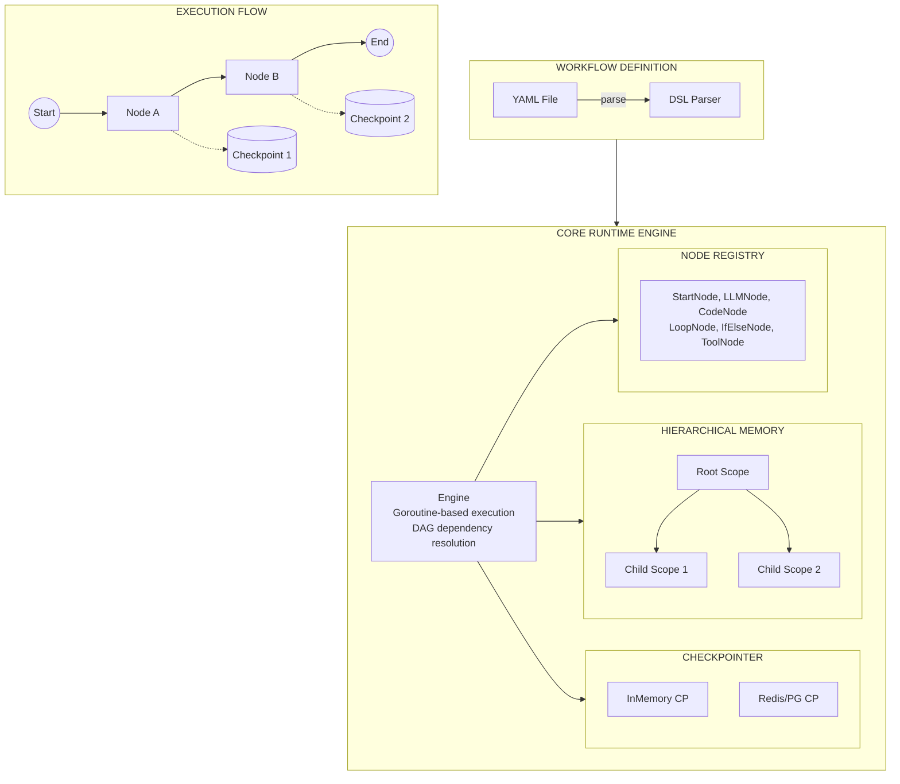
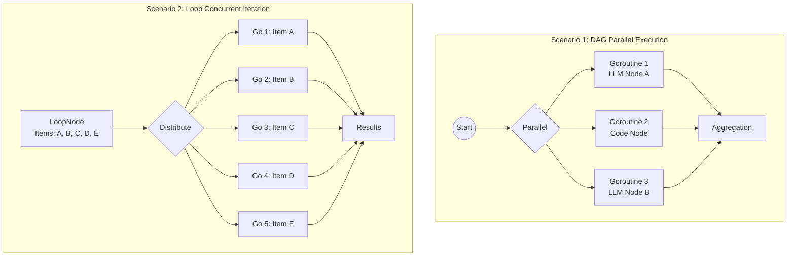

# vNext (Go)

**vNext** is a high-performance, concurrent workflow engine written in Go designed for building LLM-based applications and AI agents.

## 🚀 Key Features

*   **Native Concurrency**: Built on Go's Goroutines and Channels. Supports massive parallelism (e.g., thousands of concurrent loop iterations) with minimal overhead.
*   **Hierarchical Memory System**: Implements a tree-based scoping mechanism. Each loop iteration or parallel branch gets its own isolated memory scope, preventing variable pollution and ensuring thread safety.
*   **State Checkpointing**: Inspired by LangGraph, the engine supports a `Checkpointer` interface. State is saved as immutable snapshots after every node execution, enabling future features like "Time Travel" and reliable retries.
*   **Type-Safe & Compiled**: Static typing catches errors at build time. Deploys as a single, lightweight binary.

## 🏗️ Architecture



### Key Design Principles

- **Goroutine-Native**: Each node can spawn thousands of lightweight concurrent tasks
- **Scoped Memory**: Child scopes inherit from parent, preventing variable pollution
- **Snapshot State**: Every node execution triggers a state checkpoint
- **DAG Execution**: Topological sort with concurrent branch execution

### Concurrency Model

vNext leverages Go's native concurrency primitives to achieve high-performance parallel execution:




## 📂 Project Structure

```
dify-vnext-go/
├── cmd/
│   └── main.go           # Application entry point
├── pkg/
│   ├── dsl/              # Workflow DSL definitions and YAML parser
│   ├── engine/           # Core runtime (Engine, Memory, State/Checkpointer)
│   └── nodes/            # Node implementations (Start, LLM, Code, Loop, etc.)
├── examples/             # Example workflow YAML files
└── go.mod                # Go module definition
```

## 🛠️ Getting Started

### Prerequisites

*   **Go 1.21+** installed.
*   **OpenAI API Key** (Optional, for LLM nodes).
    ```bash
    export OPENAI_API_KEY="sk-..."
    ```
    *If not provided, LLM nodes will return mock responses.*

### Running Examples

The project comes with several example workflows to demonstrate its capabilities.

1.  **Simple Workflow** (Linear execution):
    ```bash
    go run cmd/main.go -f examples/simple.yaml
    ```

2.  **Complex Workflow** (Branching & Tools):
    ```bash
    go run cmd/main.go -f examples/complex.yaml
    ```

3.  **Customer Support Triage** (Conditional Routing):
    ```bash
    go run cmd/main.go -f examples/support_triage.yaml
    ```

4.  **Automated Code Review** (Parallel Execution):
    ```bash
    go run cmd/main.go -f examples/code_review.yaml
    ```

5.  **Multi-language Translation** (Loops):
    ```bash
    go run cmd/main.go -f examples/translation.yaml
    ```

## 🧠 Architecture Highlights

### Memory Management
vNext implements a **Hierarchical Scoping** system for memory management.
- **Global Scope**: Inputs to the `Start` node.
- **Child Scope**: Created for each `Loop` iteration.
- **Bubble-Up Lookup**: Variables are looked up in the current scope, then the parent, up to the root.
- **Isolation**: Ensures parallel branches and iterations don't interfere with each other.

### Checkpointing
The engine integrates a `Checkpointer` that saves the state of the entire memory tree after each node execution.
- **Current Implementation**: `InMemoryCheckpointer` (for MVP/Testing).
- **Future**: Redis/Postgres implementations for persistent state and time-travel debugging.

## 🤝 Contributing
Contributions are welcome! Please check the `pkg/nodes` directory to see how to implement new node types.
